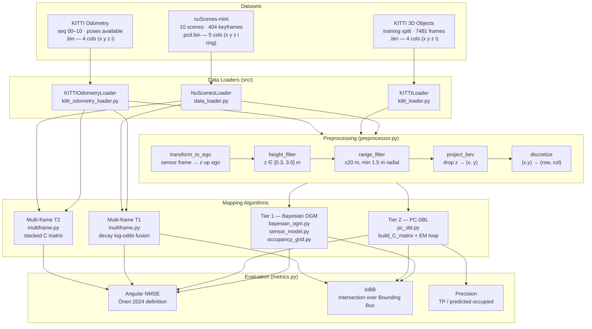
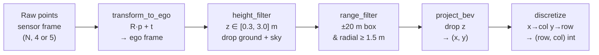
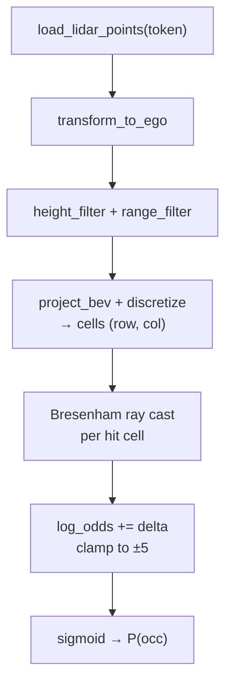
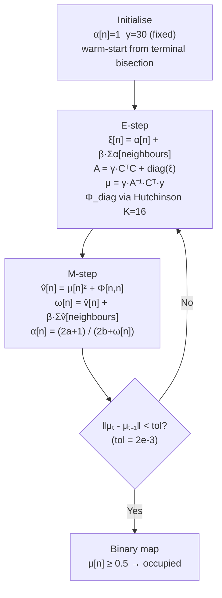
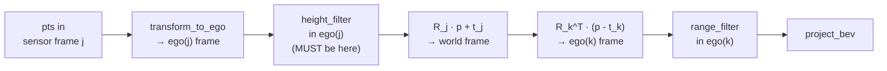
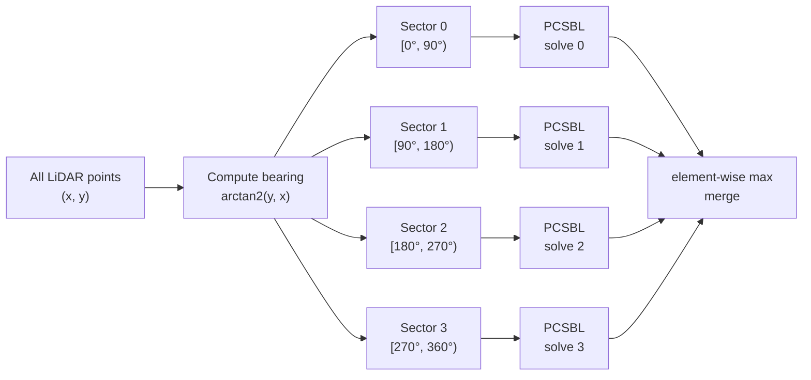
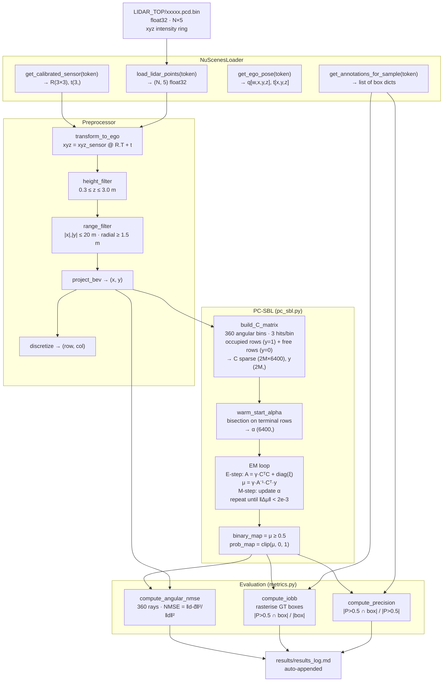
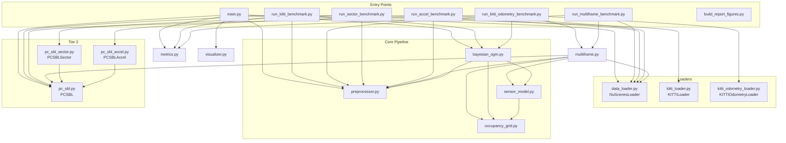

# Project details - Implementation Reference 

### Tried to compile a whole codebase 
---

## Project Overview

Autonomous vehicles move in a forward direction, so the vehicle has to constantly know what is in front of it. To identify objects around it, we use occupancy grid mapping. The basic idea: we take a LiDAR scan, divide the space around the vehicle into a grid of tiny cells, and for each cell we track a probability — is this cell occupied by an object, or is it free space?

Our primary dataset is nuScenes, and each LiDAR point has five attributes: X, Y, Z coordinates, intensity, and ring index. We drop intensity and ring — they are mostly noise-handling tools that do not feed our core algorithm — and keep X, Y, Z, which carry the actual spatial information.

First we process the Z coordinate. We do not want ground reflections or overhead objects like bridges counted as obstacles, so we filter to keep only points with Z between 0.3 and +3.0 metres — that is our height filter applied in the ego vehicle frame after the sensor-to-ego coordinate transform.

Classical occupancy grid mapping makes three assumptions. First, **binary state**: a cell is either occupied or free, not something in between. Second, a **static world**: we assume the environment does not change within a single scan. Third, **cell independence**: each cell's probability is treated as independent of its neighbours.

To update each cell's probability as new evidence arrives, the mathematically correct approach is Bayes' rule, which involves multiplying probabilities together. The problem: if you multiply probabilities across many successive scans, the number shrinks extremely fast — after enough scans it becomes too small for the computer to represent and rounds to zero. This is called numerical underflow.

To avoid this, we use **log-odds** instead. Logarithms turn multiplication into addition — log(A × B) = log(A) + log(B) — so instead of multiplying probabilities scan after scan, we just add log-odds values. No underflow. We update each cell from its previous log-odds value, and at the end we convert back to an actual probability using the sigmoid function.

One important detail: log-odds values are **clamped** between −5 and +5 at every update. Without this, a cell hit repeatedly could reach an extreme value that takes many, many future observations to undo, effectively getting locked. Clamping at ±5 means roughly six contradicting observations can reverse a strong belief, keeping the map able to change its mind when new evidence arrives.

Next is the **inverse sensor model**. It tells us: given what the LiDAR beam did, what does that say about the map? If a beam passes through a cell, that cell is probably free. If a beam terminates at a cell, that cell is probably occupied. If no beam reaches a cell, we learn nothing about it. The two update values are +0.847 for occupied evidence and −0.847 for free evidence — derived from log(0.7/0.3), assuming the sensor is 70 % reliable. To determine which cells a beam actually passed through, we use **Bresenham ray casting**, which traces the straight-line path from the sensor to the hit point, cell by cell, using only integer arithmetic.

After establishing this classical baseline (Tier 1), we move to **PC-SBL** (Tier 2). In Tier 1, each cell was treated as fully independent. In PC-SBL we add **neighbour coupling** — each cell's confidence is influenced by its four adjacent cells, not just its own evidence. We found that coupling makes a real difference: because LiDAR data is inherently sparse (it only hits object edges, not interiors), coupling lets confidently occupied edge cells support their uncertain neighbours, helping recover the object's interior structure that would otherwise be missed. Our ablation study confirmed this: β = 1 (full coupling) beats β = 0 (decoupled) on all 10 nuScenes scenes, reduces NMSE by 24.7 %, and improves EM convergence rate from 4/10 to 10/10 scenes.

---

## Table of Contents

1. [Repository Layout](#1-repository-layout)
2. [System Architecture](#2-system-architecture)
3. [Data Sources and Loaders](#3-data-sources-and-loaders)
4. [Preprocessing Pipeline](#4-preprocessing-pipeline)
5. [Tier 1 — Classical Bayesian OGM](#5-tier-1--classical-bayesian-ogm)
6. [Tier 2 — PC-SBL EM Algorithm](#6-tier-2--pc-sbl-em-algorithm)
7. [Multi-Frame Accumulation](#7-multi-frame-accumulation)
8. [Evaluation Metrics](#8-evaluation-metrics)
9. [Acceleration Experiments](#9-acceleration-experiments)
10. [Benchmark Scripts](#10-benchmark-scripts)
11. [Data Flow — End to End](#11-data-flow--end-to-end)
12. [Module Dependency Graph](#12-module-dependency-graph)

---

## 1. Repository Layout

```
lidar_gap_mapping/
│
├── main.py                        # CLI: single-scan T1 / T2, eval, logging
├── build_report_figures.py        # Phase 8: qualitative panel, β sweep, α evolution
├── run_multiframe_benchmark.py    # Phase 9: window sweep w∈{0,1,2,4}, all 10 scenes
├── run_accel_benchmark.py         # Phase 6: rectangular submap partitioning
├── run_sector_benchmark.py        # Phase 7: angular sector partitioning
├── run_kitti_benchmark.py         # Phase 10: KITTI 3D Object Detection, 50 frames
├── run_kitti_odometry_benchmark.py# Phase 11: KITTI Odometry, single + multi-frame
│
├── src/
│   ├── data_loader.py             # NuScenesLoader — JSON + .pcd.bin
│   ├── kitti_loader.py            # KITTILoader — 3D Object Detection split
│   ├── kitti_odometry_loader.py   # KITTIOdometryLoader — Odometry split (poses)
│   ├── preprocessor.py            # transform_to_ego, height_filter, range_filter,
│   │                              #   project_bev, discretize, preprocess
│   ├── occupancy_grid.py          # OccupancyGrid — 80×80 log-odds grid
│   ├── sensor_model.py            # Bresenham ray casting, update_grid_from_scan
│   ├── bayesian_ogm.py            # Tier 1: run_single_scan, run_bayesian_ogm
│   ├── pc_sbl.py                  # Tier 2: PCSBL class, build_C_matrix, EM loop
│   ├── pc_sbl_accel.py            # PCSBLAccel — rectangular tile acceleration (Phase 6)
│   ├── pc_sbl_sector.py           # PCSBLSector — angular sector acceleration (Phase 7)
│   ├── multiframe.py              # load_window, multiframe_t1, multiframe_t2
│   ├── metrics.py                 # compute_angular_nmse, compute_iobb,
│   │                              #   compute_precision, KITTI variants
│   └── visualizer.py             # plot_grid, side-by-side comparison, GT overlay
│
├── results/
│   └── results_log.md             # Auto-appended experiment log (all phases)
├── output/                        # Generated PNGs and text tables (gitignored)
├── v1.0-mini/                     # nuScenes-mini dataset (gitignored)
├── kitti/training/                # KITTI 3D Object Detection (gitignored)
└── kitti_odometry/dataset/        # KITTI Odometry sequences + poses (gitignored)
```

---

## 2. System Architecture

The overall system has three independent data paths that share the same
preprocessing core and converge at the evaluation layer.



---

## 3. Data Sources and Loaders

### 3.1 NuScenesLoader (`src/data_loader.py`)

Reads the nuScenes-mini dataset without the official SDK — pure JSON + numpy.
All metadata is loaded at `__init__` time into O(1) lookup dictionaries.

**Files read:**
| File | Purpose |
|---|---|
| `v1.0-mini/scene.json` | Scene metadata (name, description, first sample token) |
| `v1.0-mini/sample.json` | Keyframe samples — links scenes to sensor data tokens |
| `v1.0-mini/sample_data.json` | Per-sensor file paths and timestamps |
| `v1.0-mini/ego_pose.json` | Vehicle position and orientation (quaternion) per timestamp |
| `v1.0-mini/calibrated_sensor.json` | LiDAR-to-ego rotation/translation |
| `v1.0-mini/sample_annotation.json` | 3D bounding boxes for IoBB evaluation |
| `v1.0-mini/samples/LIDAR_TOP/*.pcd.bin` | Raw LiDAR point clouds |

**Key interface methods:**
```python
loader = NuScenesLoader("v1.0-mini/")
scene          = loader.get_scene_by_name("scene-0061")
tokens         = loader.get_lidar_tokens_for_scene(scene)   # ordered list
pts            = loader.load_lidar_points(token)             # (N, 5) float32
cs             = loader.get_calibrated_sensor(token)         # rotation + translation
pose           = loader.get_ego_pose(token)                  # quaternion + translation
annotations    = loader.get_annotations_for_sample(token)    # list of box dicts
```

**Point cloud format:** flat binary `float32`, 5 values per point:
```
[x, y, z, intensity, ring_index]
```
Points are in the LiDAR **sensor** frame; `transform_to_ego` moves them to the ego (vehicle) frame.

---

### 3.2 KITTILoader (`src/kitti_loader.py`)

Reads the KITTI 3D Object Detection training split. Mirrors the NuScenesLoader
interface so all downstream pipeline code runs unchanged.

**Directory layout required:**
```
kitti/training/
├── velodyne/    ← 000000.bin … (float32 N×4: x y z intensity)
├── calib/       ← 000000.txt … (Tr_velo_to_cam matrix)
└── label_2/     ← 000000.txt … (3D bounding boxes in camera frame)
```

**Coordinate transform:** KITTI points are in Velodyne sensor frame (camera convention: x=right, y=down, z=forward). Two composed rotations bring them to z-up ego frame:
```
LiDAR sensor → camera (Tr_velo_to_cam) → z-up ego (R_cam_to_ego)

R_cam_to_ego = [[1, 0,  0],
                [0, 0,  1],
                [0,-1,  0]]
```

**Limitation:** `get_ego_pose()` returns `None` — no per-frame pose in the object-detection split, so multi-frame is not available.

---

### 3.3 KITTIOdometryLoader (`src/kitti_odometry_loader.py`)

Reads the KITTI Odometry dataset, providing the poses needed for multi-frame.
Uses `(seq_name, frame_idx)` tuples as tokens, which carry the sequence context
through `load_window()` without any changes to `multiframe.py`.

**Directory layout required:**
```
kitti_odometry/dataset/
├── sequences/
│   ├── 00/velodyne/   ← 000000.bin … (float32 N×4)
│   └── …
├── sequences-calib/
│   ├── 00/calib.txt   ← single calib per sequence (Tr key)
│   └── …
└── poses/
    ├── 00.txt         ← one 3×4 matrix per line (cam0 → world)
    └── …              ← sequences 00–10 only (with ground-truth poses)
```

**Pose conversion:** each line in `poses/XX.txt` is a 3×4 cam0-to-world matrix.
Converted to the same `{rotation: [w,x,y,z], translation: [x,y,z]}` format that
`multiframe._pose_R_t()` expects:
```python
R_pose = P[:3,:3] @ R_cam_to_ego.T    # rotate ego frame to world
t_pose = P[:3, 3]                      # camera origin = ego origin after transform
q      = Rotation.from_matrix(R_pose).as_quat()   # scipy [x,y,z,w]
→ returned as [w, x, y, z]            # nuScenes convention
```

---

## 4. Preprocessing Pipeline

All three loaders feed into the same five-step pipeline in `preprocessor.py`.
Every step operates in the **ego vehicle frame** (z-up, origin at rear-axle ground).



### Step 0 — Sensor → Ego Transform (`transform_to_ego`)

```python
xyz_ego = xyz_sensor @ R.T + t
```
- nuScenes: R and t come from `calibrated_sensor.json` (quaternion → matrix)
- KITTI: R = `R_cam_to_ego @ Tr_velo_to_cam[:,:3]`, t = `R_cam_to_ego @ Tr_velo_to_cam[:,3]`
- After this step z is "up" and z=0 is the ground plane in all three datasets.

### Step 1 — Height Filter

```python
keep: z >= 0.3 m  AND  z <= 3.0 m
```
- Lower bound (0.3 m): removes road surface and ground reflections. The LiDAR is ~1.84 m above ego origin, so ground returns land near z=0 in ego frame.
- Upper bound (3.0 m): removes bridges, overpasses, tree canopy. Keeps pedestrians (~1.8 m) and trucks (~3.0 m).
- **Critical constraint for multi-frame:** height filter must be applied in ego(j) frame **before** rotating points to ego(k). After rotation, the z-axis is no longer "up" and the filter produces wrong results.

### Step 2 — Range Filter

```python
keep: |x| ≤ 20 m  AND  |y| ≤ 20 m  AND  sqrt(x²+y²) ≥ 1.5 m
```
- Box clip (±20 m) matches the grid extent — points beyond have no cell.
- Radial minimum (1.5 m): removes LiDAR self-reflection off the vehicle roof and mount structure that produces a spurious occupied blob at the ego cell.

### Step 3 — BEV Projection

Drop z. Return `(N, 2)` array of `(x, y)` coordinates in metres.

### Step 4 — Discretize

```python
col = floor((x + 20.0) / 0.5)        # x=forward → increasing col
row = floor((20.0 - y) / 0.5)        # y=left → decreasing row (numpy row 0 = top)
```
Ego vehicle sits at `(row=40, col=40)` for the default 80×80 grid.
Indices are clipped to `[0, 79]` to prevent out-of-bounds writes.

### Constants

| Parameter | Value | Meaning |
|---|---|---|
| Z_MIN | 0.3 m | Height filter floor (above ground) |
| Z_MAX | 3.0 m | Height filter ceiling |
| MIN_RANGE | 1.5 m | Radial self-reflection guard |
| HALF_RANGE | 20.0 m | Grid half-extent |
| GRID_SIZE | 80 | Cells per side |
| CELL_SIZE | 0.5 m | Metres per cell |

---

## 5. Tier 1 — Classical Bayesian OGM

Implements the log-odds binary Bayes filter from Stachniss (Freiburg SLAM lecture).
Modules: `occupancy_grid.py`, `sensor_model.py`, `bayesian_ogm.py`.

### 5.1 OccupancyGrid (`occupancy_grid.py`)

Stores a single `(80, 80) float32` array of log-odds values.

```python
grid = OccupancyGrid(grid_size=80, cell_size=0.5)

grid.update(rows, cols, delta)     # batch numpy add + clamp to [-5, +5]
grid.get_probability()             # sigmoid(log_odds) → P(occ) ∈ [0.007, 0.993]
grid.get_binary_map(threshold=0.5) # boolean mask for evaluation
```

Log-odds to probability conversion:
```
P(occ) = 1 / (1 + exp(-log_odds))

sigmoid(+5.0) = 0.993  ← strongly occupied
sigmoid( 0.0) = 0.500  ← uncertain (initial state)
sigmoid(-5.0) = 0.007  ← strongly free
```

Clamping at ±5 keeps the map adaptive — ~6 contradicting observations can reverse a strong belief rather than needing 39.

### 5.2 Bresenham Ray Casting (`sensor_model.py`)

For each LiDAR hit point `(row, col)`, a ray is cast from the ego cell `(40, 40)` using Bresenham's line algorithm (pure integer arithmetic, no floating point in the inner loop).

```python
# Inverse Sensor Model deltas
L_OCC  = log(0.7/0.3) = +0.847   # terminal cell — beam ends here → occupied
L_FREE = log(0.3/0.7) = -0.847   # intermediate cells — beam passed through → free
```

`update_grid_from_scan(grid, cells)` processes all ~4,800 surviving hit points per scan:
1. Batch Bresenham from ego to each hit cell
2. Free cells accumulated via numpy repeated-index write (each cell gets L_FREE once per scan regardless of how many rays pass through it)
3. Terminal cell gets L_OCC
4. `grid.update()` applies delta and clamps

### 5.3 Bayesian OGM (`bayesian_ogm.py`)



**Three accumulation modes (CLI flags):**

| Mode | Flag | Behaviour |
|---|---|---|
| Single-scan | `--single-scan` | One keyframe only. Cleanest output, no motion artefacts |
| World-frame | *(default)* | All 39 keyframes fused in a common world frame. Centred on trajectory centroid (not first scan — Bug 3 fix) |
| Ego-frame | `--ego-frame` | All scans accumulated in ego-centric coordinates. Produces deliberate smearing, used to demonstrate why world-frame matters |

---

## 6. Tier 2 — PC-SBL EM Algorithm

Implements the Pattern-Coupled Sparse Bayesian Learning method from Önen et al. 2024 (IEEE Sensors Journal) with the EM formulation of Fang et al. 2015 (IEEE TSP).
Module: `pc_sbl.py`.

### 6.1 Linear System Formulation

OGM is recast as a linear inverse problem:

```
y = C · f + w

f ∈ ℝᴺ          unknown occupancy vector (N = 6400 cells, values ∈ [0,1])
C ∈ {0,1}²ᴹˣᴺ  measurement matrix from ray casting (sparse)
y ∈ ℝ²ᴹ         observation labels (1 = hit, 0 = free)
w ~ N(0, σ²I)   Gaussian noise
```

**Two-equation C matrix (per angular bin):**
- **Occupied row** (y=1): single nonzero at the terminal (hit) cell
- **Free row** (y=0): nonzeros at every cell along the Bresenham ray, weighted by `free_weight=0.5`

```python
C, y = build_C_matrix(
    pts_xy,
    grid_size=80, cell_size=0.5,
    n_angles=360,               # 1° angular bins
    hits_per_bin=3,             # 3 closest hits per bin
    free_weight=0.5,
)
# C stored as scipy.sparse.csr_matrix — ~1 MB vs ~100 MB dense
```

### 6.2 Pattern-Coupled Sparsity Prior

Each cell `n` has a precision hyperparameter `α[n]` (inverse variance).
The coupling term links each cell to its 4-connected grid neighbours:

```
p(f[n] | α) = N(0, (α[n] + β · Σ_{j∈L_n} α[j])⁻¹)

β = 0: cells independent (decoupled SBL)
β = 1: full coupling (default, Önen 2024 recommendation)
```

### 6.3 EM Algorithm



**Key implementation decisions:**

| Decision | Value | Reason |
|---|---|---|
| C storage | `scipy.sparse.csr_matrix` | Dense 2000×6400 ≈ 100 MB; sparse ≈ 1 MB |
| γ (noise precision) | 30 (fixed) | Adaptive γ collapses to 0 and destroys the solution (Bug 5) |
| Φ diagonal | Hutchinson estimator K=16 | Avoids O(N³) matrix inversion; stochastic but accurate |
| Warm-start α | terminal-cell bisection | Cold start (α=1) over-prunes before coupling activates (Bug 6) |
| tol | 2e-3 | tol=1e-3 causes oscillation — EM never converges (Bug 7) |
| hits_per_bin | 3 | 3 closest hits per angular bin; empirically optimal |
| free_weight | 0.5 | Weakening free-row suppression improves sparse scenes |
| η_th | 0.5 | Binary threshold on μ for final map |
| α damping | 0.3 | Blend factor between old and new α to prevent oscillation |

---

## 7. Multi-Frame Accumulation

Implemented in `multiframe.py`. Works with both `NuScenesLoader` and `KITTIOdometryLoader` via duck-typing (type hint is `Any`).

### 7.1 Transform Chain

For each window frame `j`, points are brought into the **eval keyframe k's ego frame**:

```
p_ego_k = R_k^T · (R_j · p_ego_j + t_j - t_k)
```



The height filter at ego(j) is a critical constraint — if applied after rotation to ego(k), the z-axis is no longer vertical and the ground plane tilts, causing `occ% ≈ 55%` from ground flooding (Bug 8 fix).

### 7.2 Token Interface

`load_window(loader, scene_name, k, w)` returns a list of frame dicts:
```python
[
  {"pts_xy": (M, 2) float32, "offset": j-k, "n_raw": int},
  ...
]
# frames j ∈ [k-w, k+w] ∩ valid_range
```

### 7.3 Tier 1 Multi-Frame

Decay-weighted log-odds fusion:
```
L(cell) = clip(Σ_{j∈W} λ^|j-k| · l_update_j(cell), -5, +5)
```
- `λ = 0.85` — older frames contribute less
- Each frame j's grid is built via `update_grid_from_scan` (deduplication preserved)
- Results are summed with decay weights before sigmoid

### 7.4 Tier 2 Multi-Frame

Stack C matrices from all window frames, scaled by `λ^|j-k|`, then run one PC-SBL solve:
```python
C_stacked = vstack([λ^|j-k| · C_j  for j in window])
y_stacked = concat([λ^|j-k| · y_j  for j in window])
μ = PCSBL_EM(C_stacked, y_stacked)
```
More rows per cell = the surface-hit coverage PC-SBL was starved for in single-scan mode. Results: T2 IoBB 0.023 → 0.056 (+143%) on nuScenes.

### 7.5 Config

| Parameter | Value |
|---|---|
| Eval keyframe k | 0 (first keyframe) |
| Half-window w | 2 (uses frames k-2 to k+2 = 5 frames) |
| Decay λ | 0.85 |

---

## 8. Evaluation Metrics

Module: `metrics.py`. Two primary metrics from Önen 2024, plus Precision as a false-positive guard.

### 8.1 Angular NMSE

Measures how accurately the map reproduces free-space distances at every bearing angle.

```
For 360 angular bins (1° each):
  d[i]  = range to closest LiDAR hit in bin i  (ground truth)
  d̂[i] = range to first occupied cell (P > 0.5) along ray i

NMSE = Σ (d[i] - d̂[i])² / Σ d[i]²
```

- Ray walker starts at r = 1.5 m (avoids self-return artefacts)
- Bins with no LiDAR hit are excluded from the sum
- Lower is better — 0.0 = perfect range reproduction

### 8.2 IoBB — Intersection over Bounding Box

Measures how well predicted occupied cells fill annotated object bounding boxes.

```
For each annotated object (Car, Truck, Pedestrian, ...):
  IoBB_obj = |{P>0.5 cells} ∩ {box cells}| / |{box cells}|

Report: mean IoBB across all objects and all evaluated scenes
```

**nuScenes box rasterization:** 3D boxes from `sample_annotation.json` are projected to BEV using quaternion yaw. `matplotlib.path.Path.contains_points` handles rotated (non-axis-aligned) rectangles.

**KITTI box rasterization:** boxes in `label_2/` are in camera frame with `rotation_y`. The function `_kitti_box_bev()` converts centre `(x_cam, z_cam)` → ego `(x_ego, y_ego)` and rotates corners by `rotation_y`.

Higher is better. T1 structurally dominates because it densely fills all hit cells; T2 activates surface cells only.

### 8.3 Precision

Guards against IoBB inflation via false positives:
```
Precision = |{P>0.5 cells} ∩ {box cells}| / |{P>0.5 cells}|
```
Confirms that a rising IoBB reflects genuine coverage gain, not map-filling noise.

---

## 9. Acceleration Experiments

### 9.1 Rectangular Tile Partitioning (`src/pc_sbl_accel.py`) — FAILED

**Idea:** divide the 80×80 grid into `sg×sg` rectangular tiles, solve each independently.

**Result:**

| Tiles (sg) | Speedup | NMSE |
|---|---|---|
| 1 (baseline) | 1× | 0.078 |
| 2 | 2.7× | 0.475 |
| 4 | 14.7× | **1.187** |

NMSE > 1.0 = algorithm has no skill (worse than predicting all-zero).

**Why it fails:** PC-SBL's free-row ISM constraint requires the Bresenham ray origin (ego vehicle at cell (40,40)) to be present in every subgrid. Rectangular tiles place the ego at the corner (sg=2) or outside (sg=4) of distant submaps, severing the free-space constraint entirely.

### 9.2 Angular Sector Partitioning (`src/pc_sbl_sector.py`) — VALIDATED

**Idea:** partition by bearing angle from ego. Each sector is a wedge with ego at its apex, so every Bresenham ray stays entirely within one sector.

**Result:**

| K sectors | NMSE preserved | Implementation |
|---|---|---|
| 1 (baseline) | ✅ reference | Full grid |
| 2 | ✅ exact match | 180° wedges |
| 4 | ✅ exact match | 90° wedges |
| 8 | ⚠️ slight degradation on scene-0061 | 45° wedges — boundary coupling loss |

**K=8 degradation reason:** at 45° sector width, the 4-neighbour coupling `ξ[n] = α[n] + β·Σα[neighbours]` is computed per-sector using only that sector's posterior. Cells near a seam lose cross-sector coupling reinforcement. This affects scene-0061 (26 objects, densest scene) most because more object clusters straddle sector boundaries at narrower wedge widths.

**Speedup limitation:** current implementation solves K independent N×N systems (full grid per sector, only hits are filtered). True speedup requires a polar-grid representation reducing each sector's solve to (N/K)×(N/K). Identified as validated future work.



---

## 10. Benchmark Scripts

### `main.py` — Primary CLI

```bash
# Tier 1 single scan with evaluation
python3 main.py --scene scene-0061 --single-scan --eval --no-show

# Tier 2 PC-SBL β ablation
python3 main.py --scene scene-0061 --single-scan --tier2 --beta 0.0 --eval --no-show
python3 main.py --scene scene-0061 --single-scan --tier2 --beta 1.0 --eval --no-show

# All 10 scenes
python3 main.py --all-scenes --single-scan --eval --no-show
```

All results appended to `results/results_log.md`.

### `run_kitti_benchmark.py` — KITTI 3D Object Detection (Phase 10)

Runs T1, T2(β=0), T2(β=1) on 50 KITTI frames. Produces `output/kitti_benchmark.png` and `output/kitti_table.txt`.

```bash
python3 run_kitti_benchmark.py --n-frames 50 --verbose
```

### `run_kitti_odometry_benchmark.py` — KITTI Odometry (Phase 11)

Runs T1 and T2(β=1) in **both single-scan and multi-frame modes** across KITTI Odometry sequences. Results appended per-frame (safe to interrupt — no data lost on cancellation).

```bash
# Quick 5-frame sanity check
python3 run_kitti_odometry_benchmark.py --sequence 00 --n-frames 5 --verbose

# Full 50-frame benchmark, seq 05
python3 run_kitti_odometry_benchmark.py --sequence 05 --n-frames 50 --window 2
```

### `run_multiframe_benchmark.py` — nuScenes Multi-Frame Sweep (Phase 9)

Window sweep `w ∈ {0, 1, 2, 4}` across all 10 nuScenes scenes, both tiers.

```bash
python3 run_multiframe_benchmark.py
```

---

## 11. Data Flow — End to End

This diagram shows the complete path from raw `.bin` file to evaluation number for a single nuScenes keyframe in Tier 2 mode.



---

## 12. Module Dependency Graph



---

## Quick Reference — Run Commands

```bash
PYTHON=~/.pyenv/versions/3.11.9/bin/python3

# ── nuScenes ──────────────────────────────────────────────────────────────────
# Tier 1 all scenes
$PYTHON main.py --all-scenes --single-scan --eval --no-show

# Tier 2 β ablation (all scenes)
$PYTHON main.py --all-scenes --single-scan --tier2 --beta 0.0 --eval --no-show
$PYTHON main.py --all-scenes --single-scan --tier2 --beta 1.0 --eval --no-show

# Multi-frame benchmark (window sweep)
$PYTHON run_multiframe_benchmark.py

# ── KITTI 3D Object Detection ─────────────────────────────────────────────────
$PYTHON run_kitti_benchmark.py --n-frames 50

# ── KITTI Odometry ────────────────────────────────────────────────────────────
$PYTHON run_kitti_odometry_benchmark.py --sequence 00 --n-frames 50 --window 2
$PYTHON run_kitti_odometry_benchmark.py --sequence 05 --n-frames 50 --window 2

# ── Acceleration experiments ──────────────────────────────────────────────────
$PYTHON run_accel_benchmark.py     # rectangular tiles (negative result)
$PYTHON run_sector_benchmark.py    # angular sectors (accuracy preserved)

# ── Report figures ────────────────────────────────────────────────────────────
$PYTHON build_report_figures.py    # qualitative panel, β sweep, α evolution
```

---

*Last updated: 2026-07-05*